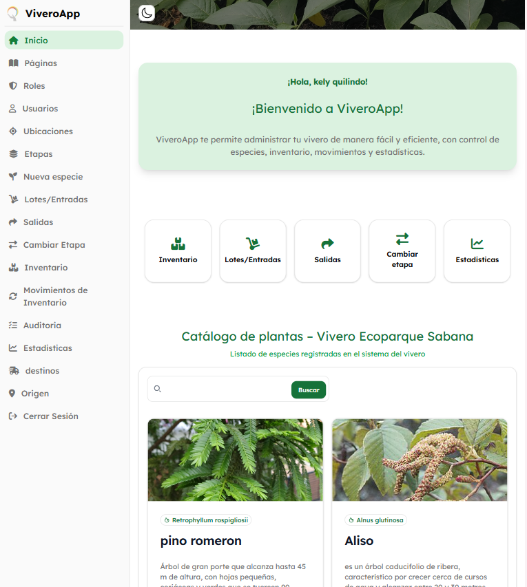
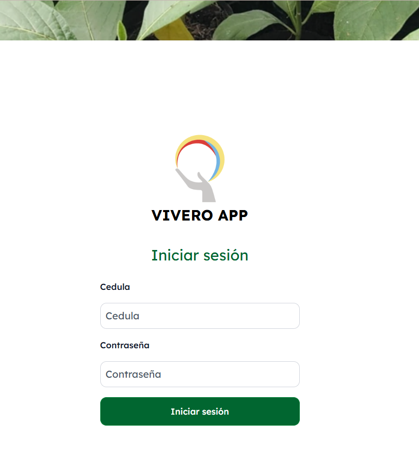
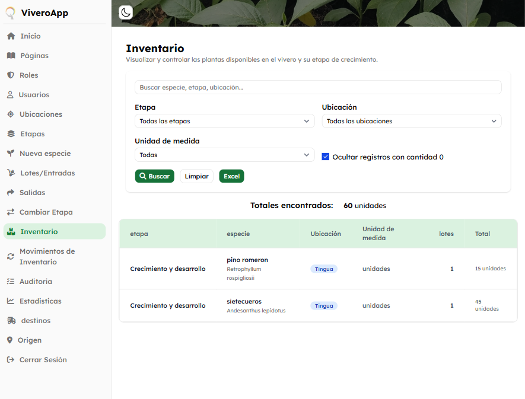
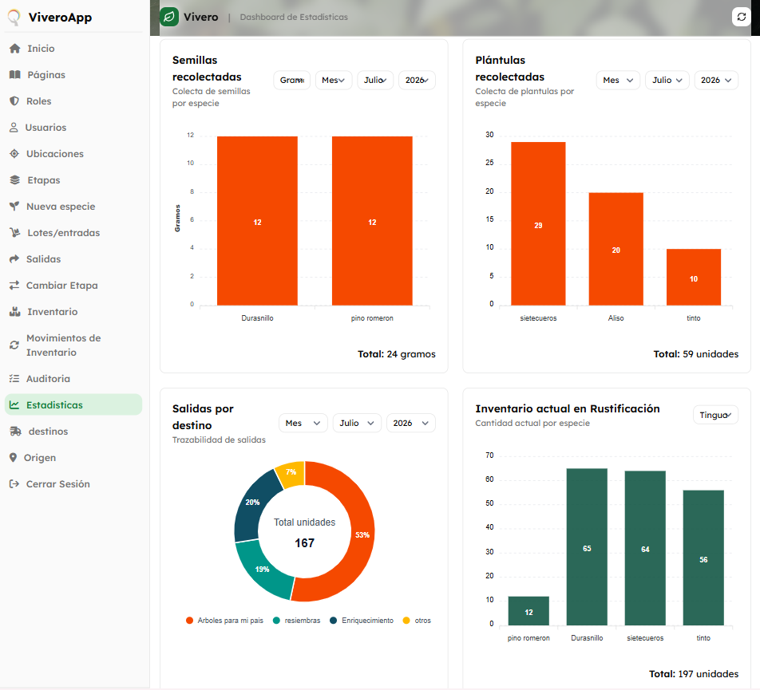

# ViveroApp

Sistema web desarrollado para optimizar la gestión del inventario de un vivero, permitiendo el control del material vegetal desde su registro hasta el seguimiento de los movimientos de inventario, con el fin de mejorar la organización de la información y apoyar la toma de decisiones.

---

##  Descripción del proyecto
ViveroApp fue desarrollado durante mi práctica profesional en el Parque Jaime Duque como una solución para digitalizar la gestión del inventario del vivero institucional.

A diferencia de un vivero comercial, este vivero está orientado a la producción y conservación de material vegetal destinado principalmente a programas de restauración ambiental, enriquecimiento ecológico y donación de plantas. Por ello, el sistema se enfoca en el control del inventario, el seguimiento de las etapas de crecimiento y el registro de los movimientos del material vegetal, facilitando la administración de la información y reduciendo los procesos manuales.

##  Objetivos

- Digitalizar la gestión del inventario del vivero.
- Centralizar la información del material vegetal.
- Registrar entradas y salidas del inventario.
- Generar reportes para el control de existencias.
- Visualizar estadísticas que apoyen la toma de decisiones.

---

#  Tecnologías utilizadas

| Tecnología       | Descripción                  |
|------------------|------------------------------|
| PHP              | Desarrollo del backend       |
| JavaScript       | Interactividad del sistema   |
| HTML5            | Estructura de las interfaces |
| CSS3             | Diseño de la aplicación      |
| Tailwind CSS     | Framework para estilos       |
| MySQL            | Base de datos                |
| Arquitectura MVC | Organización del proyecto    |

---

# Funcionalidades principales

- Inicio de sesión de usuarios.
- Administración de plantas.
- Registro y gestión de lotes.
- Control de inventario por etapas y ubicaciones.
- Registro de movimientos de entrada y salida.
- Generación de reportes.
- Visualización de estadísticas.
- Auditoría de movimientos.
- Gestión de usuarios y roles.

---

# Base de datos

La aplicación utiliza **MySQL** como sistema gestor de bases de datos para almacenar la información relacionada con:

- Plantas
- Lotes
- Inventario
- Etapas de crecimiento
- Ubicaciones
- Movimientos de inventario
- Usuarios
- Roles
- Auditoría

---

# Mi participación

Durante mi práctica profesional participé en el desarrollo del proyecto realizando actividades como:

- Desarrollo de funcionalidades de la aplicación web.
- Implementación y mantenimiento de consultas SQL.
- Desarrollo de interfaces utilizando HTML, CSS, JavaScript y Tailwind CSS.
- Apoyo en la implementación del patrón de arquitectura MVC.
- Validación de formularios.
- Corrección de errores y pruebas del sistema.
- Elaboración de documentación técnica.
- Trabajo colaborativo con un desarrollador junior bajo la supervisión del ingeniero líder del área.

---

#  Capturas del sistema

##  Inicio de sesión

Pantalla de autenticación para el acceso seguro al sistema.

---

## Página principal

Vista inicial de la aplicación con acceso rápido a los principales módulos del sistema y catálogo de especies registradas.

---

##  Gestión de inventario

Módulo para consultar y controlar el inventario del vivero mediante filtros por especie, etapa, ubicación y unidad de medida.

---

##  Dashboard de estadísticas

Panel con indicadores y gráficos que permiten analizar el comportamiento del inventario y los movimientos registrados.

---

# Estado del proyecto

 Proyecto funcional desarrollado durante la práctica profesional.

Actualmente continúa como parte de mi portafolio académico y profesional.

---

#  Autor

**Kely Yohana Quilindo Hernández**

Estudiante de Ingeniería de Sistemas  
Corporación Unificada Nacional de Educación Superior (CUN)

---

##  Contacto

 Correo: **quilindok88@gmail.com**

 GitHub: **https://github.com/itskely**
